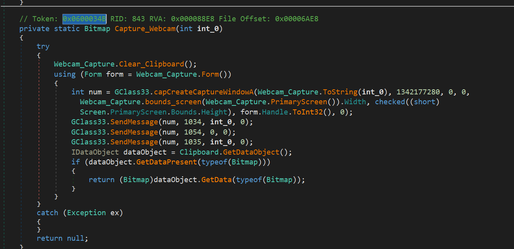
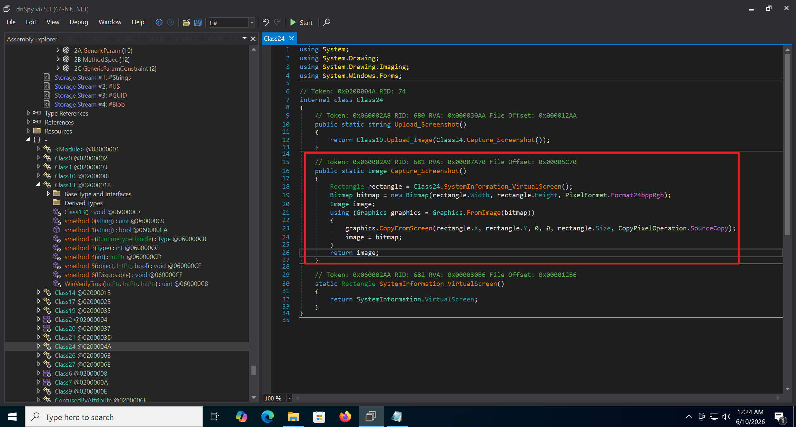
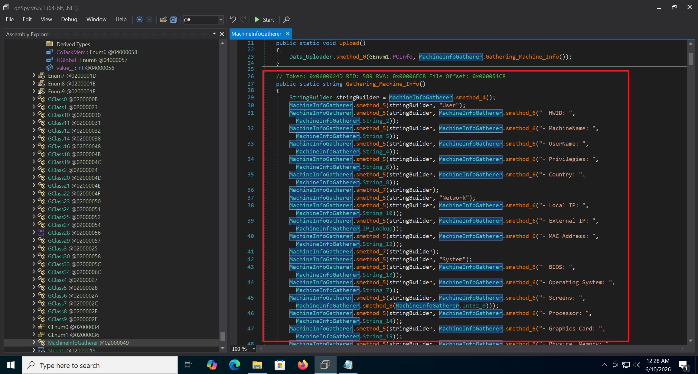
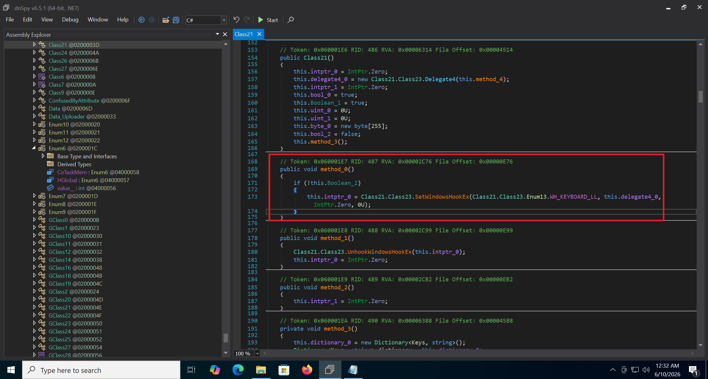

# Background

As part of extending my work into detection engineering, I worked through the **HawkEye Lab** on CyberDefenders. From the provided packet capture I extracted a malware sample. The scenario describes a victim who opened a phishing email, which caused the malware to be downloaded onto the host.


This post documents the full analysis from the loader to the payload, and is the first entry in a detection research series that I plan to keep updating.

# Overview

HawkEye Keylogger is a long-running keylogger written in C#. Its earliest campaigns date back to 2016, and the sample analyzed here is already version 9. VirusTotal records renewed activity in 2023, spread through phishing emails. Its main capabilities include stealing device information, logging keystrokes, taking screenshots, and even recording the victim's webcam.

# Deep Analysis

## Loader

The executable obtained from Wireshark is a loader written in **AutoIt 3**.


We can recover the AutoIt script with [unAutoIt](https://github.com/digitalsleuth/UnAutoIt). The content is shown below:


Besides obfuscating variable and string names, the script uses two functions to obfuscate strings.


These two functions are used heavily throughout the script to obfuscate all strings and byte arrays. By following the logic of these two functions, we can write a script to decode them. The script is available in my repo.

The loader decrypts the resources **hvax641** and **pcalua2** into the malware payload.


The resource decryption function:


The shellcode then performs process hollowing on `RegAsm.exe` to inject and run the malware.


After deobfuscation we obtain the shellcode:


The hardcoded shellcode starts with:

```text
55 8B EC 8B 4D 08 ...
```

Here, `55 8B EC` is a typical 32-bit x86 function prologue:

```asm
push ebp
mov  ebp, esp
```

When injecting the shellcode, the `DllCallAddress` parameters show that the shellcode entry point is at `0xBE`.


Three arguments are passed in. The actual values are:

```text
arg1 = 'C:\Windows\Microsoft.NET\Framework\v2.0.50727\RegAsm.exe'
arg2 = ''
arg3 = decrypted .NET PE bytes (hvax641 + pcalua2)
```


## Shellcode

In IDA, the reconstructed function at `0xBE` also takes three arguments, which confirms that this is the shellcode entry point.


It reads the `IMAGE_DOS_HEADER` information from the malware payload.


It then performs process hollowing. Here it calls `CreateProcessW` to start `RegAsm.exe` with `dwCreationFlags` set to 4, which is `CREATE_SUSPENDED`.


At this point the behavior is clear. Readers who want to go further can [download the sample](https://github.com/kmes9940502/malware-detection-rules/blob/main/malware/HawkEye_SMTP.zip) for a deeper analysis.

## Payload

Loading the payload into DIE shows that it is written in C# and obfuscated with ConfuserEx, which can be deobfuscated directly with de4dot.


The deobfuscated code:


The sample is now fully recovered, so we can run it through CAPA.


CAPA identifies many capabilities, and it is very useful for triaging an unpacked sample. It also produces false positives, so manual review is still needed. For example, the function above that CAPA labels as geolocation is in fact a POST request used to send collected data back. The sample provides four methods for exfiltrating data, grouped in class `0x02000033`.


This sample uses SMTP to send data back, in function `0x06000177`. The code is shown below:


The behavior matches the log provided in the lab, where the payload IP was identified using an IP lookup service.


The C2 configuration is decrypted from the `RCDATA` resource through `0x0600036C`.

Key: `0cd08c62-955c-4bdb-aa2b-a33280e3ddce`


The decryption function:


Algorithm settings (AES decryption):

```text
Key/password:
0cd08c62-955c-4bdb-aa2b-a33280e3ddce

Cipher:
RijndaelManaged
Key size: 256-bit
Block size: 128-bit
Mode: CBC
Padding: PKCS7
```


The decrypted `RCDATA`:


After deserialization we can recover the C2 details:

```text
SMTP server: macwinlogistics[.]in
SMTP user:   sales.del@macwinlogistics.in
SMTP pass:   Sales@23
SMTP port:   587
SSL:         false
```

## Other Capabilities

* Webcam capture (`0x0600034B`):

* Screenshot (`0x060002A9`):

* System information collection (`0x0600024D`):

* Keylogging through system event hooks (`0x060001E7`):


There are many more functions. For a deeper analysis, please [download the sample](https://github.com/kmes9940502/malware-detection-rules/blob/main/malware/HawkEye_SMTP.zip).

## Conclusion

This analysis followed the full chain, from the AutoIt loader to the injected shellcode and finally the C# payload. The key stages were resource decryption, process hollowing into `RegAsm.exe`, AES-based C2 decryption from `RCDATA`, and the main surveillance features such as keylogging, screenshots, webcam capture, and system information collection.

CAPA proved very useful for quickly mapping the capabilities and locations of components in an unpacked sample. At the same time, manual verification is still necessary, since the tool can misclassify functions, as seen with the supposed geolocation routine that was actually a data exfiltration POST request.
