# Overview

According to VirusTotal, this sample was first seen in 2017. MalwareBazaar shows that it was uploaded to the database on 2023-12-06.

The sample is wrapped in several layers of loaders, while the final payload is protected with a customized version of ConfuserEx. Since the analysis is fairly long, I will split it into two parts.

# Deep Analysis

## MD5

Original sample: `939aa21bbb29c3a09dfd80c155a8a63e`

## Delphi Loader

The original sample is a loader written in Borland Delphi.

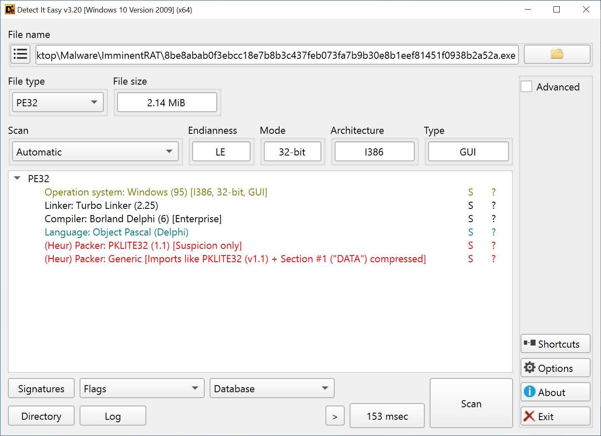

It masquerades as Malwarebytes antivirus software to trick the user into opening it.

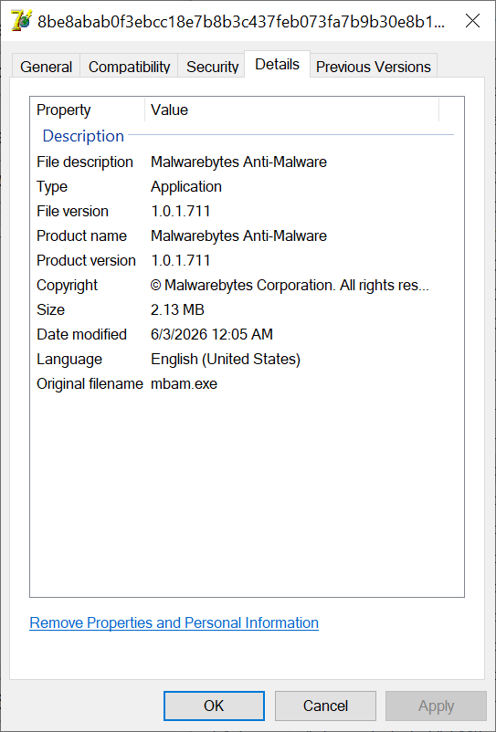

Delphi first calls `InitExe()` to perform unit initialization, iterating through the functions in an initialization table. Malicious code is often inserted here so that it runs during startup.

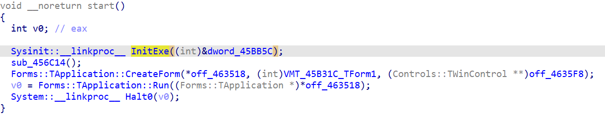

The function at the end of the table, `sub_45B93C`, contains the loader's main logic.

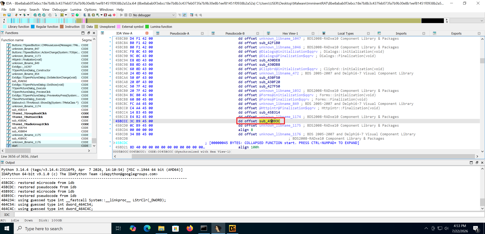

The main routine performs many meaningless operations and uses a large number of empty loops to delay execution.

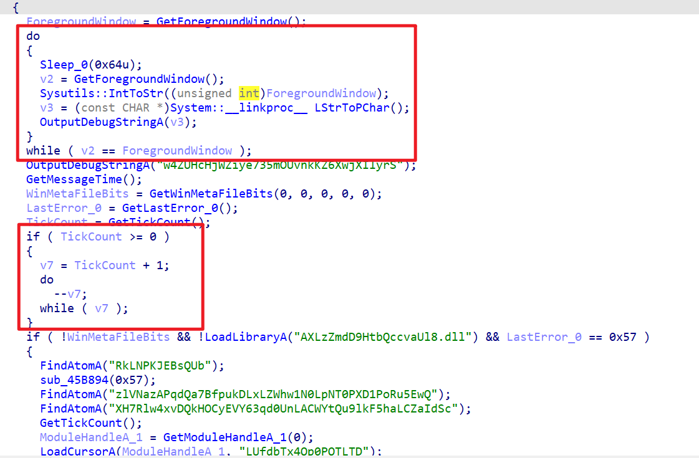

The decryption flow is `0x45B894` → `0x45B794`. Function `0x45B794` decrypts the next-stage payload and loads it into memory. The payload is `0x65E4` bytes long.

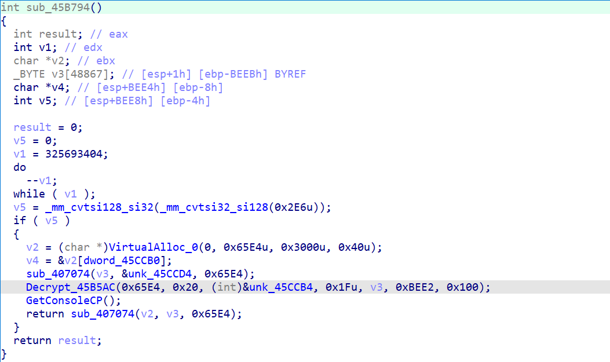

Function `0x45B5AC` implements a modified RC4 algorithm. Since this is only a loader stage, I focus on recovering the next payload instead of digging too deeply into the algorithm itself.

During dynamic analysis, we can change `EIP` to skip the long delay loop. Once execution reaches the memory-loading routine at `0x45B862`, we can recover the next-stage payload. This payload is shellcode, with its entry point at offset `0x42B7`.

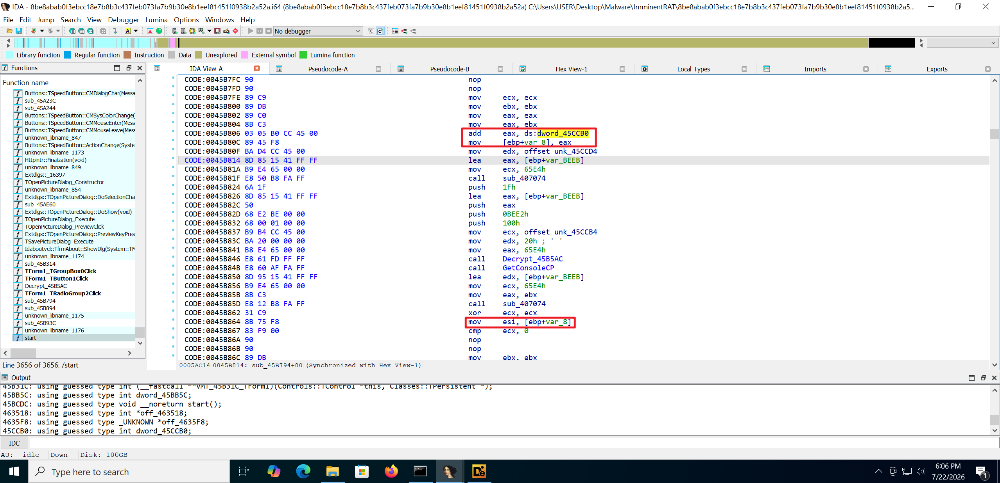

The loader transfers execution to `VirtualAlloc base + 0x42B7`.

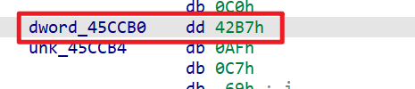

## Shellcode Loader

### Static Analysis

The shellcode uses numerous jumps and `0x78` bytes for obfuscation. Fortunately, IDA Pro can still identify the boundaries of most functions.

Starting from the entry point, execution follows a series of jumps to `0xD94`, which then calls `0x1B1C` to resolve and initialize the APIs.

The API list can be recovered through dynamic analysis and represented as a structure in IDA to make the code easier to analyze. The reconstructed result looks roughly like this:

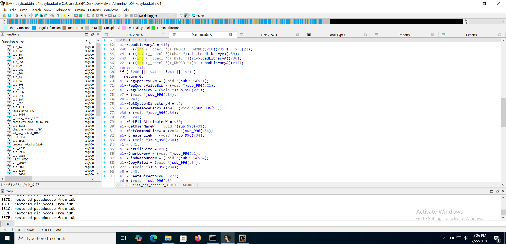

The control flow leading into the main routine is:

```text
42B7 → F59 → 4549 → 4F27 → D94
     → 460A → 9E0
     → 4262 → 4277
     → 4C2 → 371B → 3A78
     → CB5
     → 117 → 3CF0 → 5E7F → 5690
```

At the end of the main routine, the shellcode decrypts the next-stage payload with RC4 and loads it through process hollowing.

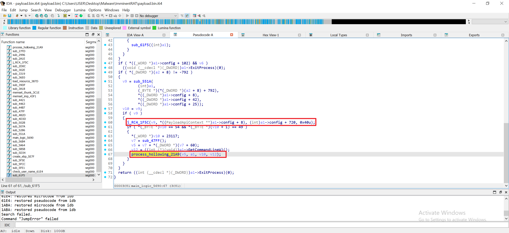

After `0x21A9` verifies that the next-stage payload begins with a valid executable header, the shellcode performs process hollowing.

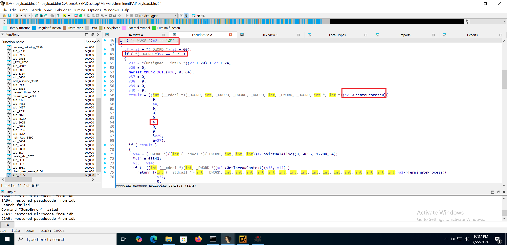

### Anti-Sandbox and Anti-Debugging Checks

`0x1ABA`: Checks for virtual-machine drivers.

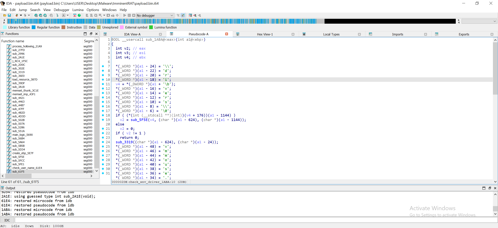

`0x61E4`: Checks the username for known sandbox indicators.

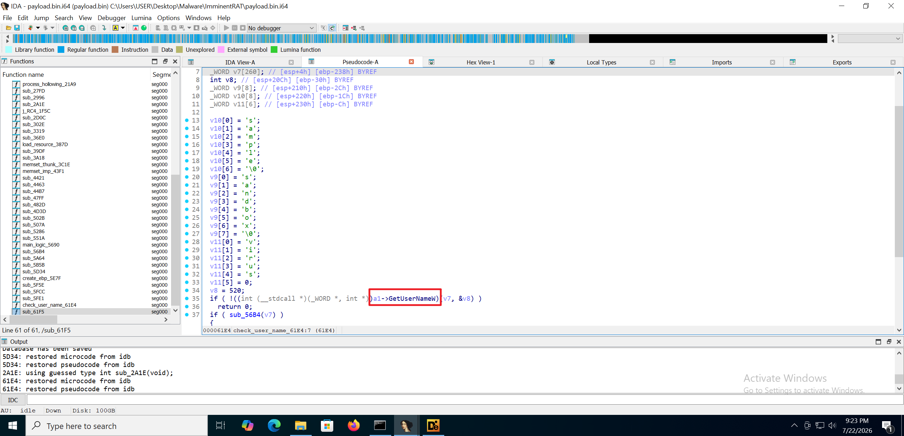

`0x5D34`: Queries `PhysicalDrive0` for virtual-machine indicators.

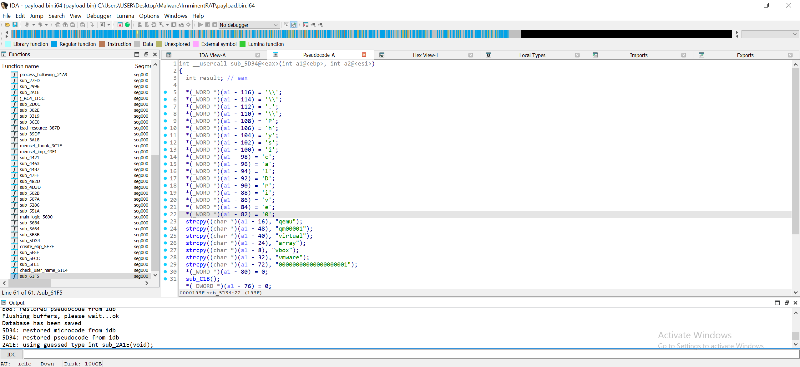

### Dynamic Analysis

During dynamic analysis, the shellcode extracts a resource from the original executable. We therefore need to begin with the original sample and allow the shellcode to decrypt the resource.

The anti-analysis checks can be bypassed as follows:

```text
base + 0x9E0:  Set EAX to 0 to bypass the first check
base + 0xCB9:  Set [esi+2CCh] to 0 to bypass the driver check
base + 0x4874: Set [esi+310h] to 0 to bypass the VM check in the main routine
```

After these changes, we can let the code run to `0x34D6` or `0x21A9` and dump the next-stage payload. Its size is passed to the RC4 routine in the argument at `[eax+20]`.

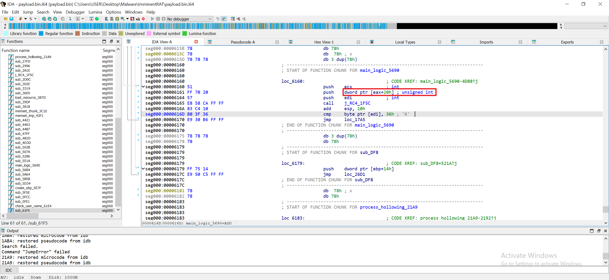

At this point, the next-stage payload has been loaded into memory.

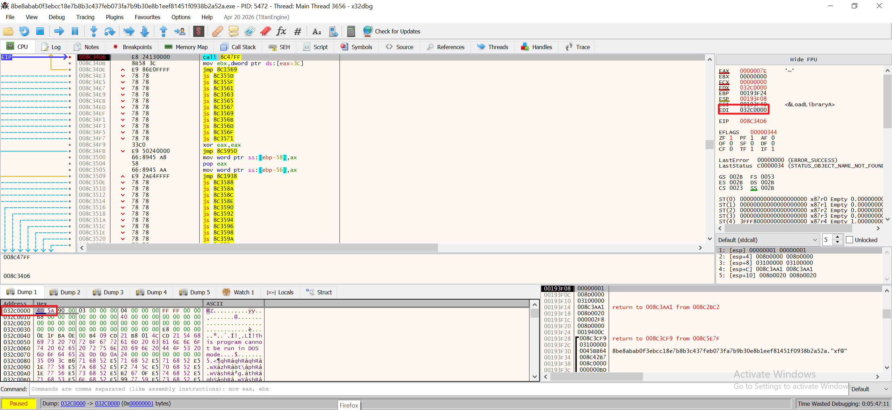

Dumping this memory region gives us the next-stage executable.

## Second-Stage Payload

The payload is packed with UPX. After unpacking it, we find yet another loader containing three embedded payloads.

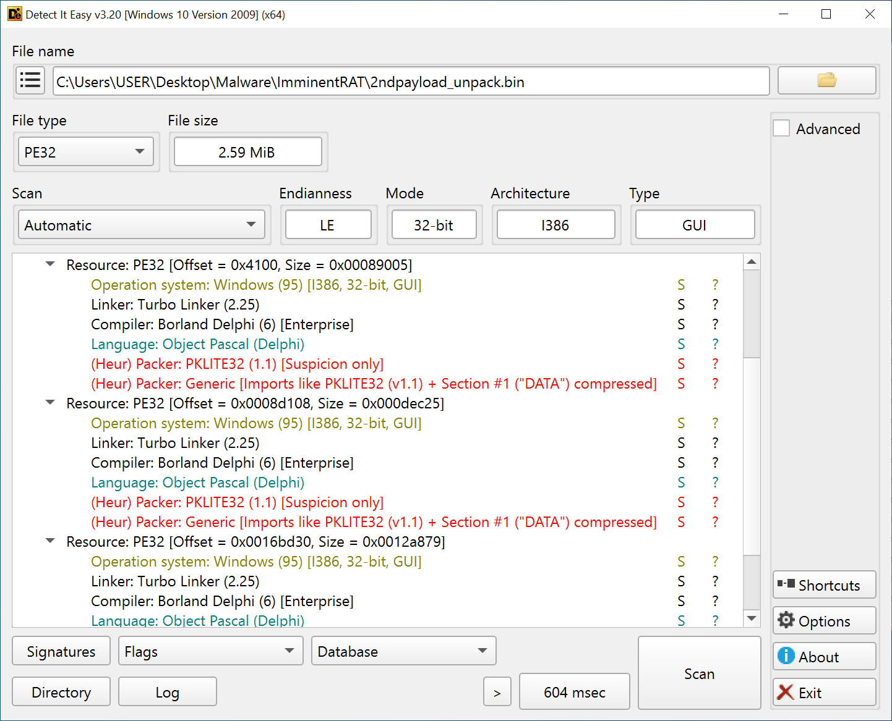

This loader is relatively simple: it extracts the three payloads from its resources and executes them.

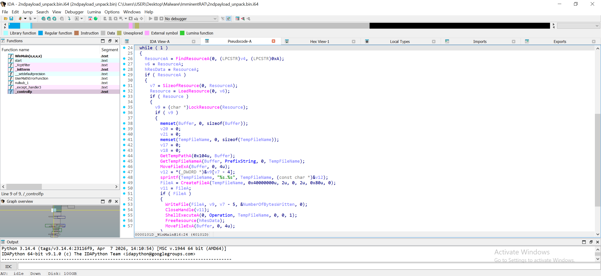

All three payloads use the same Borland Delphi loader seen at the beginning of the analysis. Repeating the same procedure recovers the next stage from each one, although those payloads are also packed.

## Conclusion

The sample contains three separate malware payloads buried beneath multiple nested loaders and packers, followed by a customized `ConfuserEx` layer. This makes the full chain fairly tedious to analyze. One of the continuing challenges in malware analysis is learning when not to spend time on details that are unnecessary for reaching the next stage—preserving both time and energy for the parts that matter.
