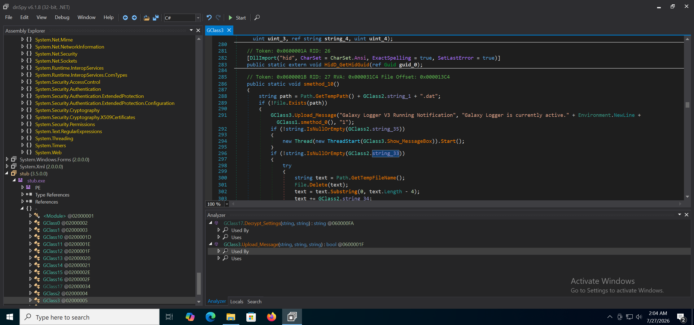
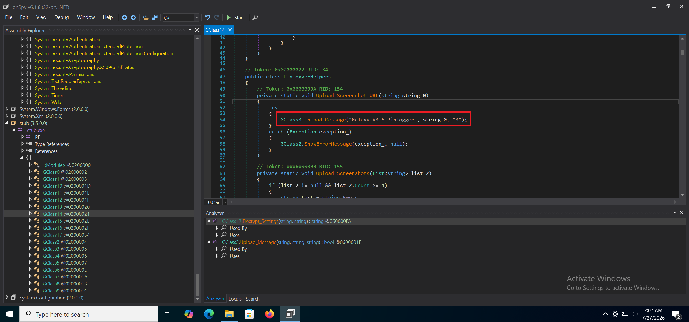
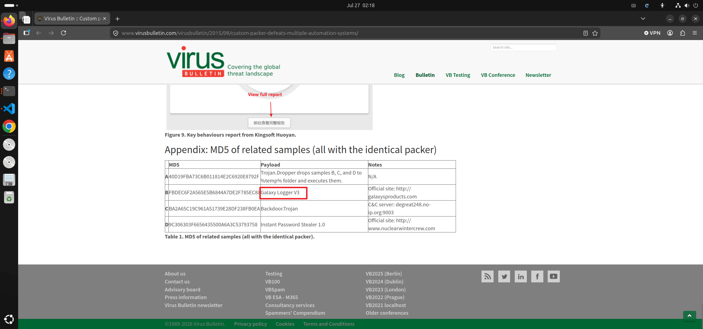
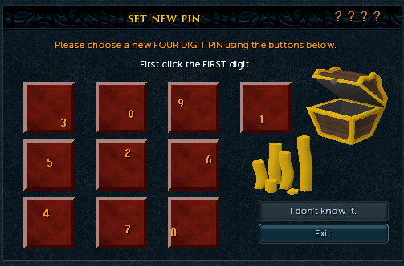
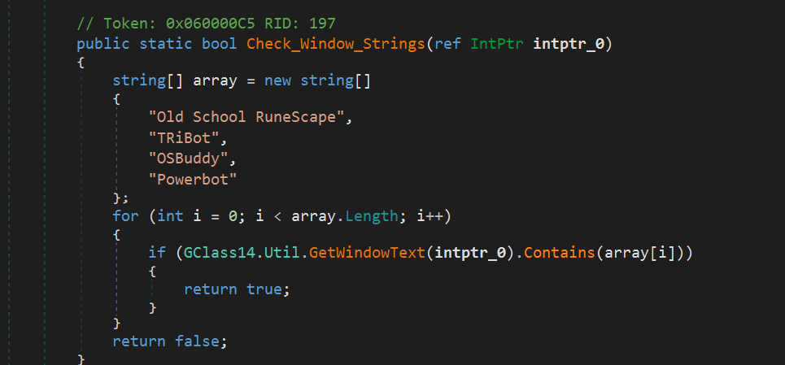

# 概要:
銜接上篇，接下來分析其中的三個載荷
(三個載荷各自還有 Packer/Loader 但主要都是從 resource 解密 Payload 的流程。因篇幅關係不過多贅述)

# 深度分析

## Galaxy Logger V3
第一個 payload 為 Galaxy Logger V3，從許多發送 message 到伺服器的行為便可知

這裡顯示版本號為 V3.6

這是2015年的老 KeyLogger 了，沒想到也出現在這個組合包中

接下來就針對幾個主要功能說明

### RuneScape PIN

針對 [Old School RuneScape](https://en.wikipedia.org/wiki/Old_School_RuneScape) 這款遊戲竊取其中的 PIN 碼，因為作者沒玩過這款遊戲猜測應該是銀行系統之類的東西

Galaxy Logger 會尋找 RuneScape 的視窗特徵、偵測 PIN pad 畫面、啟用MouseHook、在玩家點擊後截圖並上傳

尋找視窗特徵 : Logger 會搜尋 Window 上的字串，符合特徵回傳`True`

若搜尋不到字串也會檢測 Java 的 `SunAwtCanvas`

