# 概要:
銜接上篇，接下來分析三個載荷的其中一個
(三個載荷各自還有 Packer/Loader 但主要都是從 resource 解密 Payload 的流程。因篇幅關係不過多贅述)

# 深度分析

## Galaxy Logger V3
第一個 payload 為 Galaxy Logger V3，從許多發送 message 到伺服器的行為便可知


這裡顯示版本號為 V3.6


這是2015年的老 KeyLogger 了，沒想到也出現在這個組合包中


接下來就針對幾個主要功能說明

### RuneScape PIN

針對 [Old School RuneScape](https://en.wikipedia.org/wiki/Old_School_RuneScape) 這款遊戲竊取其中的 PIN 碼，因為作者沒玩過這款遊戲猜測應該是銀行系統之類的東西


Galaxy Logger 會尋找 RuneScape 的視窗特徵、偵測 PIN pad 畫面、啟用MouseHook、在玩家點擊後截圖並上傳

尋找視窗特徵 : Logger 會搜尋 Window 上的字串，符合特徵回傳`True`


若搜尋不到字串也會檢測 Java 的 `SunAwtCanvas`
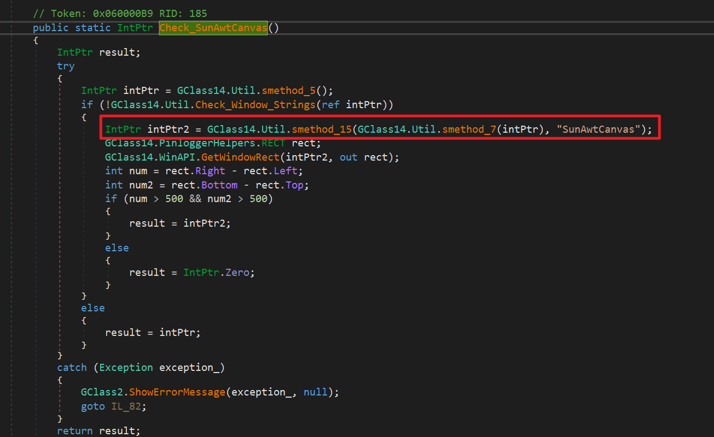

接下來檢測是否在 PIN pad、檢測到畫面就啟用 MouseHook
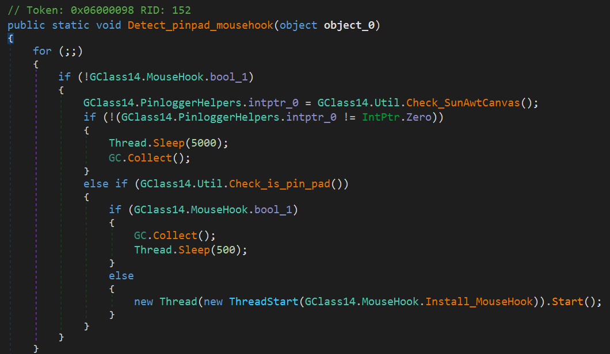

檢測 Pinpad 片段:
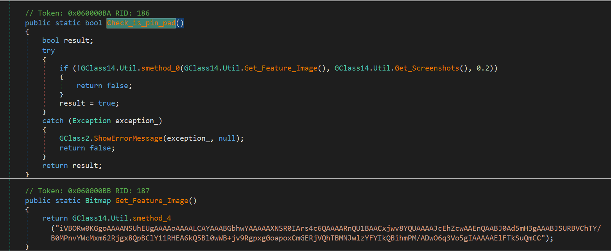
Base64 編碼的image解出來長這樣(用來檢測按鈕邊界):
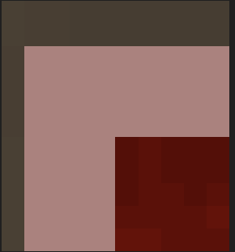
啟用 MouseHook
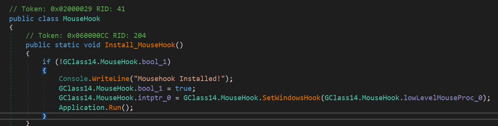
集滿四張圖片就上傳到C2
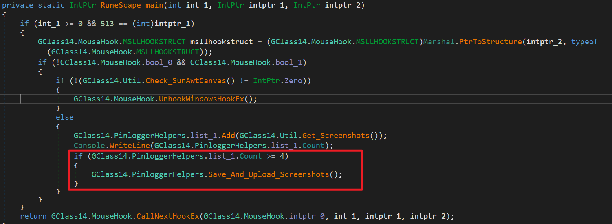
這邊見到第一個 C2: `http://uploads[.]im/api?upload`
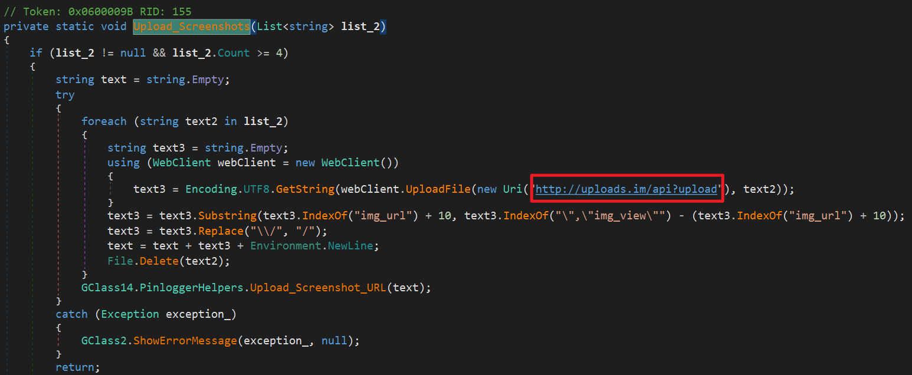

### PWS.bin Loader

Logger 下載了一個名為`PWS.bin`的檔案，寫到`/stext \<tempfile>`中進行process hollowing啟動
這邊找到第二個 C2: `http://galaxysproducts[.]com/pws/PWS[.]bin`
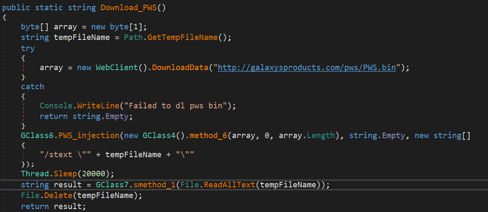
隨機選擇 `MSBuild`、`InstallUtil`、`RegAsm`做為目標
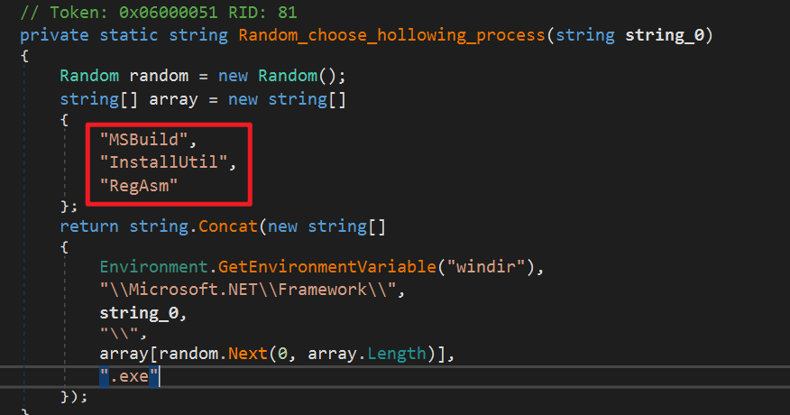
Process Hollowing的證據
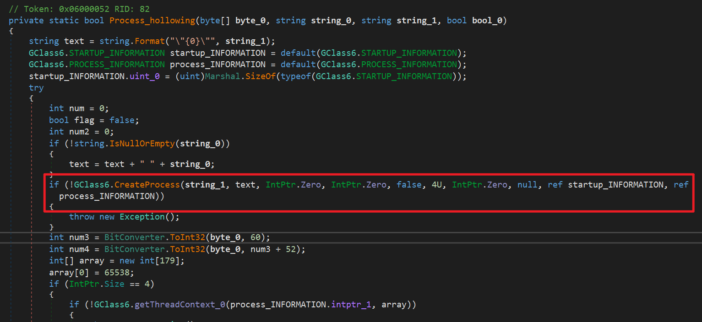

啟動後解析許多欄位，推測是用來竊取瀏覽器密碼的功能
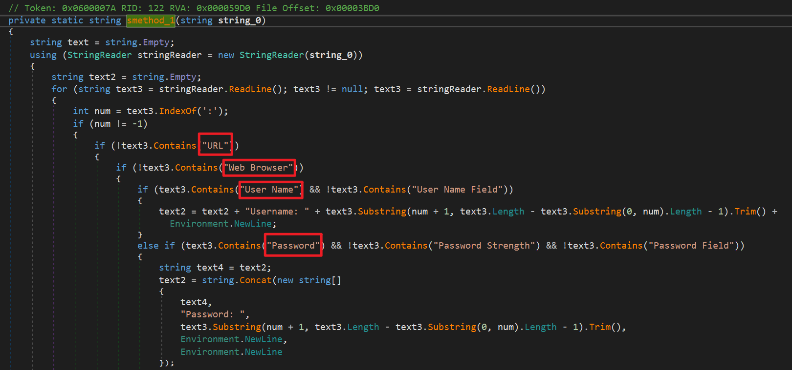

### 解密

解密 Script 放在 [這裡](https://github.com/kmes9940502/malware-detection-rules/blob/main/malware/Galaxy_Logger_V3/scripts/decrypter.cs)，找個Online C# compiler 就可以跑。
各類金鑰、C2 indicator都放在 `Token: 0x04000003` 附近
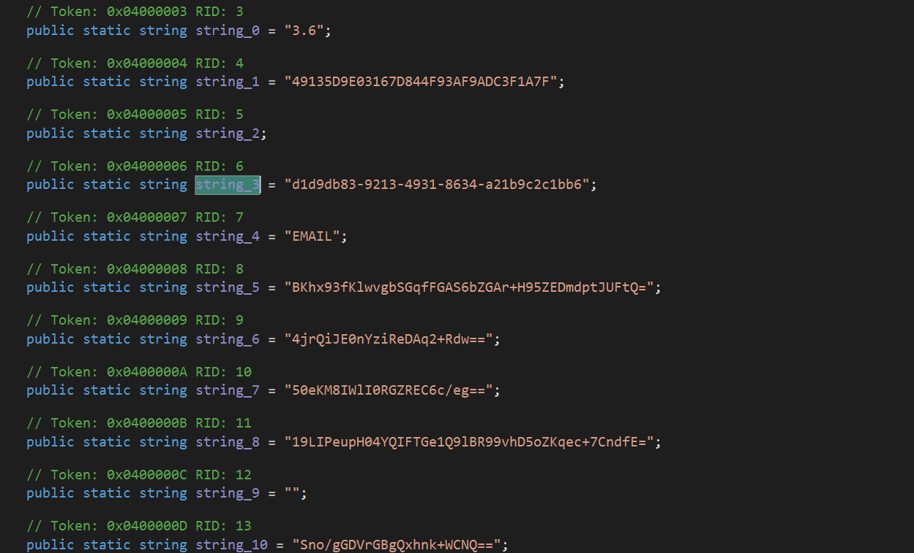

解密大量Config
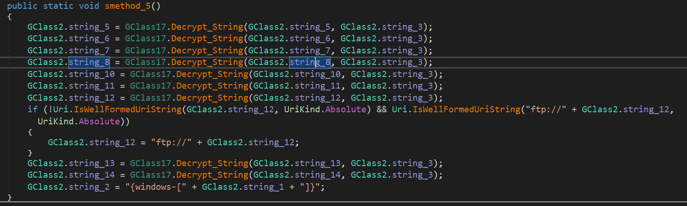

解出來的C2 有:
```
tony@rixcsgsm[.]com
smtp.rixcsgsm[.]com
ftp.host[.]com
http://galaxysproducts[.]com/testpanel
```

### 其他 C2
在 `Token: 0x0600000A` 呼叫另一個 C2 用以查詢受害者的 IPv4 地址
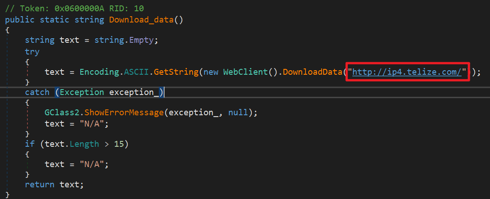
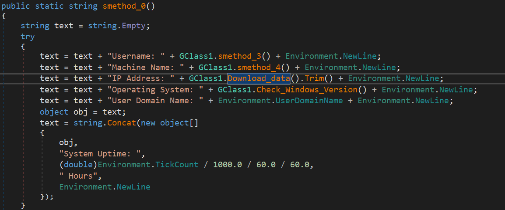

C2: `http://ip4.telize[.]com/`

## IOCs
### C2 Indicators
```
http://uploads[.]im/api?upload
http://galaxysproducts[.]com/pws/PWS.bin
tony@rixcsgsm[.]com
smtp[.]rixcsgsm.com
ftp"//ftp[.]host.com
http://galaxysproducts[.]com/testpanel
ip4[.]telize.com
```

**下篇分析另一個 Payload**
