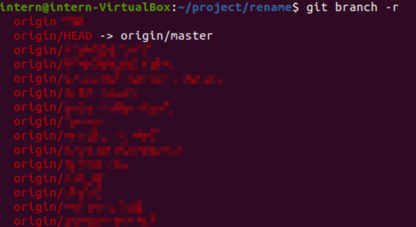

# 前言

這篇筆記是對於 Git 進行專案管理的一些思路

是我 2024 年在網路攝影機公司當實習生的時候寫的筆記，過了這麼久總算有時間整理成文章了

# 關於分支 Branch:

## 相關指令

```bash
git branch -r #查看遠程分支
git branch    #查看本地分支
git branch <branch name> #新增本地分支
git checkout -b <new branch name> #新增並切換至該分支
```

## 使用場景

- **維持主線程式碼正常運行：**
    
    開發程式碼的時候會希望能不斷提交 commit 進行進度儲存，而為了維持專案在一個可以完整運行的狀態，在新的 Branch 上開發能保證主線不會有開發未完成導致無法編譯運行的情況
    
- **合作專案開發新功能：**
    
    在多人合作一個專案的情況下，如果所有人都直接修改主線(main或master)會造成許多版本衝突，每次 Push 之前還要先拉下最新的分支，人數一多甚至會造成管理混亂
    
    所以在開發新功能前先建立新分支，待開發完成後再 merge 回主線是個比較好的做法
    
    實際場景：
    
    
    
- **緊急修正：**
    
    在遇到正式版本有bug的時候，可以立馬切換回該 Release 版本打補丁，正在開發的工作進度則不會受影響
    
- **Release 版本**：
    
    Branch 也可以用來管理 Release 的各版本，存放每個穩定版本方便進行版控
    
    例如 PHP 專案：
    
    
    

## **實作方法**

建立一個分支的方法

```bash
git branch <new branch name>    #建立一個新分支
git checkout <new branch name>  #切換到該分支
...                             #經過一些開發
git add <your changes>          #加入開發檔案
git commit -m "Your messages"   #推送commit
git push origin <new branch name> #將分支推送到遠端
```

開發完成後Merge 回主線

```bash
git checkout master    #先回到主線
git pull               #更新本地主線至最新版
git merge <your branch name> #merge分支回到主線
git status             #檢查是否有衝突,哪些檔案發生衝突
## 推薦使用 vscode 解衝突，簡單又高效
```

同理也可以從其他分支branch出來，然後merge回其他分支

```bash
git checkout <parent branch>    #回到原分支
git pull                        #更新本地主線至最新版
git merge <your branch name>    #merge分支回到主線
```

合併完成後刪除支線

```bash
git branch -d <your branch name>        #刪除本地分支
git push <remote> --delete <branch> #刪除遠端分支
```

### 備註

在使用分支進行開發的時候，建議不要離原分支太遠，導致 merge 回去的時候難以控管 更新內容

# 推送更新的技巧

## 使用場景

很多時候我們並不希望一些內容(如SDK，執行檔，暫存檔等等)被推上遠端，因為可能造成以下問題

- 浪費遠端空間
- 增加不必要的下載時間
- 非預期的錯誤(如: 暫存設定內的錯誤路徑導致編譯失敗等)

有些管理較鬆散的專案很難用 .gitignore 排除這些內容，make clean也不一定能清乾淨

因此推送更新時有一些技巧可以避免將上述內容推上遠端

### 一、善用git status

```bash
git status
```

這個指令可以快速協助我們查看哪些檔案被修改，哪些檔案尚未進行版控


我們可以從列表查看要更新的檔案，避免遺漏某些修改內容

### 二、用git diff檢查修改內容

```bash
git diff <file name> #查看該檔案的更動內容
git diff --cached    #檢查專案內git add過，有差異的檔案
git diff --name-only --diff-filter=D <commit hash 1> <commit hash 2># 檢查某兩個commit的「特定差異」檔案，D為刪除, A為新增, M為修改
# --name-only參數：僅顯示檔名
```

用 git status 查看之後，如果出現預期以外的修改，或是想檢查修改的內容的話，可以用git diff查看修改內容


紅色為移除的內容，綠色為新增的內容

在出現未預期的修改內容時，用 git diff 可以非常方便的查看是否為意外更動，從而避免產生奇怪的 bug

### 三、git add 的用法

```bash
git add .           #新增所有當前目錄下的檔案
git add <file name> #個別新增檔案
```

一般來說大家習慣用 git add . 直接加入整個目錄，但在一些大型專案、嵌入式系統、或管理較鬆散的專案中，有時候很難用 .gitignore 去限縮想版控的檔案，這時候用 git add 配合 git status 就可以很方便的管控要 commit 的內容

- 已經 add 過的檔案會顯示成綠色


每寫一些內容就 add 一次，在 commit 的時候就不會打到手軟了

### 四、將專案回復到乾淨狀態

很多時候，我們在編譯完專案後會產生許多中間檔案，許多檔案不一定完全被 Makefile 管理，並且有些在編譯時被更動的設定檔會造成 status 的清單越來越長，適時將專案清理乾淨也是很重要的

想要將專案完全清理乾淨，請使出以下組合拳

```bash
git clean -dxf          #清理不在版本控制下的檔案
# d: 遞迴刪除路經中的檔案  x: 不使用gitignore規則  f: 強制刪除，沒有這個參數clean不會動作
git reset --hard HEAD   #將專案復原到最後一次commit
```

如此一來所有不在版控下的檔案與更動都會被刪除，所以在執行前一定要用 git status 檢查以確保所有更動都有被儲存

```bash
git clean -dxf --dry-run  #加入-n或--dry-run可以演練一次clean的過程，
git clean -dnfx           # 實際不會刪除任何東西
```

經過實測這兩行指令可以將專案清空到最乾淨的狀態。當我們需要測試從 remote clone 下來的專案能否正常編譯時也可以使用

當然前提是 git repo 的內容有被妥善管理啦

### 五、強制覆蓋最新專案進度

有時候休個長假回來、換到另一台設備開發、或是進度嚴重落後的時候，發現 pull request 與本地進度有衝突，如果想強制 pull 新進度的話 `git pull --force` 是行不通的，這時使用以下指令

```bash
git fetch --all  # fetch最新的遠端進度
git reset --hard origin/<branch-name>  # 覆蓋當前的 local branch
```

這樣就能強制覆蓋該 branch 的最新進度而不用手動解衝突

⚠️注意：該步驟會將該 local branch 內容永久覆蓋，請確保所有所需改動已 push 上 遠端 repositiry

## 後記

從上方的筆記可以很清楚地了解到 git repo 管理的重要性，很多時候為了開發方便將程式碼亂放，或是因為不熟悉 git 操作導致版控內容混亂的行為，加上專案持續進行的雪球效應，會使後續的維護與管理變得極為困難。很多不明所以的 Bug 與漏洞都是這樣產生的，導致後續的開發不順利

小弟在學生時期因為專案規模小、開發週期極短、合作人數少，且人員流動率並不高(都是作業與產學居多，不太會有人員更動)，於是幾乎沒怎麼在管專案管理。但實際到了業界，見過了極致混亂的場面、比山還重的歷史包袱，以及死不寫註解的先賢先烈(已離職同事)們，才意識到專案管理的重要性。擁有一套完整的專案版控 SOP  才能使專案走得長遠。
